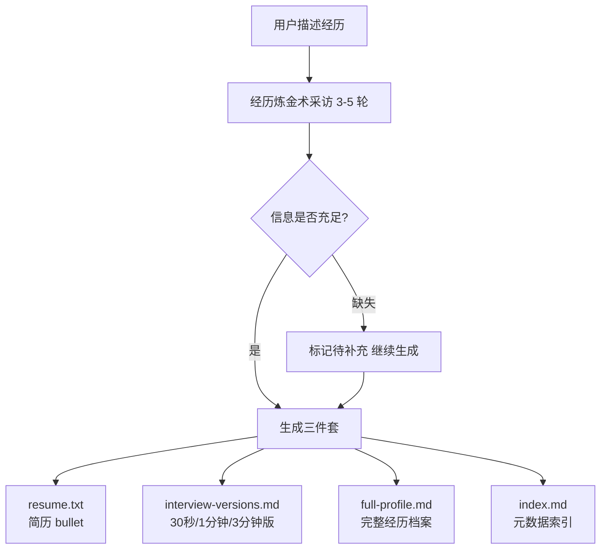

# 经历炼金术（Experience Refinery）

你有没有过这样的体验：写简历时盯着一段实习经历半小时不知道怎么下笔，或者面试官问"讲一讲你做过最有代表性的项目"，你脑子里有很多东西但不知道从哪里开始？

这个 Skill 做一件事：通过对话式采访，把你的一段经历提炼为三种可以直接用的素材。

---

## 它能做什么

输入一段口语化的经历描述（实习/项目/学生工作/竞赛/科研），经过 3-5 轮采访后，输出：

| 产出物 | 格式 | 用途 |
|-------|------|------|
| `resume.txt` | 纯文本 | 3-5 条可直接复制进简历的 bullet point |
| `interview-versions.md` | Markdown | 30 秒/1 分钟/3 分钟三个面试讲述版本 |
| `full-profile.md` | Markdown | 含 STAR 拆解、潜在追问点、亮点钩子的深度档案 |
| `index.md` | Markdown + YAML | 元数据索引（为后续 JD 解码器模块预留接口） |

---

## 工作流程



---

## 快速安装

### Claude Code 用户

```bash
# 克隆到 skills 目录
git clone https://github.com/YOUR_USERNAME/experience-refinery \
  ~/.claude/skills/experience-refinery

# 验证安装
ls ~/.claude/skills/experience-refinery/SKILL.md
```

安装后，在 Claude Code 的任意对话里说"帮我整理一段实习经历"即可触发。

### Claude.ai 用户

1. 下载本仓库的 `SKILL.md` 文件
2. 在 Claude.ai 的对话里，上传该文件并说"请按照这个 Skill 的要求帮我整理经历"
3. 或者使用下方的"纯 Prompt 降级版"，无需安装

---

## 使用示例

**用户输入**：
> "我去年暑假在抖音电商做产品实习，做了一个创作者激励相关的功能，数据还不错，但我不知道怎么写简历和讲给面试官听。"

**经历炼金术采访（第 1 轮）**：
> "好，我来帮你提炼。先问两个基础问题：你在这个团队的具体角色是什么，是独立负责一个方向，还是参与支持？另外，你现在求职的目标方向是什么？"

**经过 4 轮采访后，生成文件夹**：`experiences/douyin-pm-intern-2023-07/`

**简历版示例输出**（`resume.txt`）：
```
字节跳动（抖音电商）| 产品实习生 | 2023.07 - 2023.09

• 主导创作者成就体系从 0 到 1 设计与落地，独立完成需求定义、PRD 输出及全流程推进，功能按时上线零延期
• 自发开展中腰部达人深访 15+ 人，发现"平台认可感"是激励核心驱动力，据此调整成就展示设计，开发周期压缩 67%
• 功能上线 2 周内，创作者月活留存率提升约 11%，验证平台认可型激励机制对达人留存的正向效果
• 识别并处理上线前 PRD 对齐偏差，当天闭环，避免影响上线节点
```

查看完整示例：[examples/](examples/)

---

## 与其他模块的关系

经历炼金术是「实习/秋招求职助手」系列的第一个模块：

| 模块 | 状态 | 功能 |
|------|------|------|
| 经历炼金术（本 Skill） | v1.0 已发布 | 经历提炼 → 简历+面试素材 |
| JD 解码器 | v2.0 规划中 | 读取 JD + 匹配已有经历 → 面试针对性准备 |
| 模拟面试官 | v3.0 规划中 | 基于经历档案生成追问 → 30 分钟真实面试模拟 |
| 求职策略师 | v4.0 规划中 | 整合所有经历 + 目标岗位 → 投递策略和 timeline |

`index.md` 和 `full-profile.md` 的字段设计已为后续模块预留接口，安装使用请保持字段名不变。

---

## 降级方案：纯 Prompt 版

如果你使用的是 ChatGPT、DeepSeek、Kimi 或其他 LLM，可以直接复制以下 prompt，粘贴到对话框使用。不需要任何文件，输出直接在对话里显示。

---

```
你现在是一个经历提炼助手，专门帮求职者把口语化的实习/项目经历整理成简历可用的描述和面试讲述版本。

## 你的工作方式

你会通过 3-5 轮对话式采访来收集信息，而不是一次性问完所有问题。每轮问 1-3 个相关问题，等我回答后再进行下一轮。

你的采访风格是有经验的求职导师，不是调查问卷。

坏的问法："你学到了什么？"
好的问法："这段经历里你做的最难的决策是什么？现在回看会怎么改？"

坏的问法："有什么数据吗？"
好的问法："上线后有什么变化？哪怕是定性的反馈也行，比如老板说了什么、有没有被复用。"

## 采访框架（STAR）

你需要收集以下五类信息（可以缺失，但要标注）：
- S（背景）：公司/规模、我的角色、时间
- T（任务）：我具体负责什么、和团队目标的关系
- A（行动）：3-5 个关键动作，挑最能体现思考的，不要流水账
- R（结果）：量化数据优先，没有量化数据就要定性成果
- 反思：做得好的和如果重做会改的

追问优先级：量化数据 > 差异化贡献 > 关键决策 > 跨部门协作 > 反思

## 信息充足后，生成以下三种产出物

### 产出物 1：简历版（3-5 条 bullet point）

格式要求：
- 动词开头（主导/搭建/优化/驱动/落地/设计）
- 不用主语"我"
- 每条不超过 60 个汉字
- 至少 1 条含量化数据
- 禁止：深度参与/有效推动/积极配合/做了一些

示例：
• 主导 XX 功能从 0 到 1 设计，覆盖 3 类核心用户场景，上线后 DAU 提升 18%
• 搭建 XX 数据看板，将团队复盘效率从 3 天缩短至半天，被 5 个业务组复用

### 产出物 2：面试讲述版（三个长度）

- 30 秒版（约 90 字）：一句背景 + 一句核心动作 + 一句结果
- 1 分钟版（约 250 字）：STAR 各维度各一句话，完整不展开
- 3 分钟版（约 700 字）：STAR 完整 + 关键决策细节 + 反思 + 1 个诱饵细节（引导面试官追问的有趣点）

### 产出物 3：完整经历档案

包含：
1. STAR 四维度完整拆解
2. 亮点钩子（3-5 个最能让面试官眼前一亮的点）
3. 潜在追问点（5 个，每个附 1 句应对思路）
4. 延展故事线（3 个可以引申的话题方向）

## 异常情况处理

- 用户拒绝回答：继续生成，缺失部分标 [待补充：建议补充 XX 方向的信息]
- 经历涉及保密信息：提醒脱敏（数据用百分比/量级，公司名用"某头部 XX 公司"）
- 经历单薄：正常生成，在档案里诚实标注"该经历建议作为辅助经历"

## 开始

现在，请先告诉我：
1. 你要整理的是什么类型的经历？（实习/项目/学生工作/竞赛/科研）
2. 你目前求职的目标方向是什么？

然后把你的经历描述发给我，我来开始采访。
```

---

## 路线图

| 版本 | 时间 | 计划 |
|------|------|------|
| v1.0 | 当前 | 经历采访 + 三件套生成，互联网产品/运营方向优化 |
| v1.1 | 规划中 | 支持英文简历版输出；非互联网行业适配 |
| v2.0 | 规划中 | JD 解码器：读取岗位 JD，匹配已有经历，生成针对性面试准备 |
| v3.0 | 规划中 | 模拟面试官：基于经历档案生成追问，30 分钟真实面试模拟 |
| v4.0 | 规划中 | 求职策略师：整合所有经历，给出投递策略和 timeline |

---

## 反馈与贡献

遇到问题或有改进建议，请提 [GitHub Issue](https://github.com/YOUR_USERNAME/experience-refinery/issues)。

特别欢迎：
- 你用这个 Skill 生成的真实输出（可脱敏后分享）
- 非互联网行业的使用反馈
- 采访问题的改进建议

---

## 5 分钟快速试用

1. 安装完成后，打开 Claude Code，进入任意目录
2. 输入："帮我整理一段实习经历"
3. 告诉 Claude 你的经历类型和目标方向
4. 把你的经历描述发过去（口语化描述就行，不需要整理好再发）
5. 回答 3-5 轮采访问题
6. 查看生成的 `experiences/` 文件夹，里面有四个文件

总耗时：10-20 分钟（包括采访时间）

---

## License

MIT License. 详见 [LICENSE](LICENSE).
