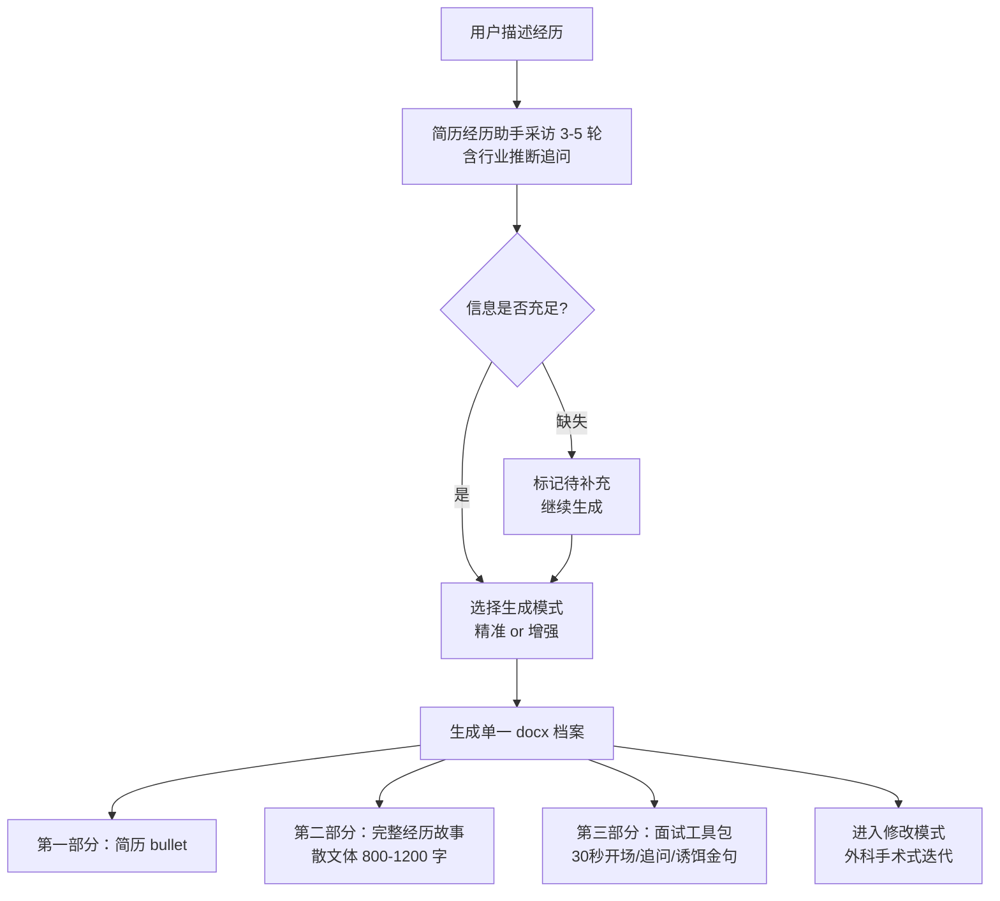

# 简历经历助手（Resume Experience Coach）

你有没有过这样的体验：写简历时盯着一段实习经历半小时不知道怎么下笔，或者面试官问"讲一讲你做过最有代表性的项目"，你脑子里有很多东西但不知道从哪里开始？

这个 Skill 做一件事：通过对话式采访，把你的一段经历整理成一份可以直接用的求职档案。

---

## 它能做什么

输入一段口语化的经历描述（实习/项目/学生工作/竞赛/科研），经过 3-5 轮采访后，输出一个 `.docx` 文件，包含三个不重叠的部分：

| 部分 | 内容 | 用途 |
|------|------|------|
| 第一部分：简历版 | 3-5 条 bullet point | 可直接复制进简历 |
| 第二部分：完整经历故事 | 800-1200 字散文叙述 | 梳理经历全貌，面试深度备战的底本 |
| 第三部分：面试工具包 | 30 秒开场 + 核心亮点 + 预测追问×5 + 诱饵金句 | 面试前专项备战 |

支持两种生成模式：
- **精准模式**：只整理你说的内容，不添加任何推断
- **增强模式**：在你的内容基础上，根据岗位和行业补充合理细节，所有补充内容用 ★ 标注供你确认

---

## 工作流程



---

## 快速安装

### Claude Code 用户

```bash
# 克隆到 skills 目录
git clone https://github.com/hirclelili/experience-refinery \
  ~/.claude/skills/resume-experience-coach

# 验证安装
ls ~/.claude/skills/resume-experience-coach/SKILL.md
```

安装后，在 Claude Code 的任意对话里说"帮我整理一段实习经历"即可触发。

### Claude.ai 用户

1. 下载本仓库的 `SKILL.md` 文件
2. 在 Claude.ai 的对话里，上传该文件并说"请按照这个 Skill 的要求帮我整理经历"
3. 或者使用下方的"纯 Prompt 降级版"，无需安装

---

## 使用示例

**用户输入**：
> "我去年暑假在抖音电商做产品实习，做了一个创作者激励相关的功能，数据还不错，但我不知道怎么写简历和讲给面试官听。"

**简历经历助手采访（第 1 轮）**：
> "好，我来帮你整理。先问两个问题：你在这个团队是独立负责一个方向，还是参与支持？你现在求职的目标方向是什么？"

**经过 4 轮采访 + 选择增强模式后，生成文件**：

`experiences/douyin-pm-intern-2023-07/抖音电商创作者成就体系-经历档案.docx`

**简历版示例**（文档第一部分）：
```
字节跳动（抖音电商）| 产品实习生 | 2023.07 - 2023.09

• 主导创作者成就体系从 0 到 1 设计与落地，独立完成需求定义、PRD 输出及全流程推进，功能按时上线零延期
• 自发开展中腰部达人深访 15 人，识别"平台认可感"为留存核心驱动力，据此重构成就展示机制，开发周期压缩 67%
• 功能上线 2 周内，创作者月活留存率提升约 11%，验证平台认可型激励对达人留存的正向效果
• 识别上线前 PRD 对齐偏差并当天现场闭环，避免影响上线节点
```

查看完整示例：[examples/](examples/)

---

## 与其他模块的关系

简历经历助手是「实习/秋招求职助手」系列的第一个模块：

| 模块 | 状态 | 功能 |
|------|------|------|
| 简历经历助手（本 Skill） | v1.2 当前 | 经历整理 → 简历条目 + 完整故事 + 面试工具包 |
| JD 解码器 | v2.0 规划中 | 读取岗位 JD，匹配已有经历，生成针对性面试准备 |
| 模拟面试官 | v3.0 规划中 | 基于经历档案生成追问，模拟真实面试对话 |
| 求职策略师 | v4.0 规划中 | 整合所有经历，给出投递策略和 timeline |

文档附录中的元数据字段已为后续模块预留接口，安装使用请保持字段名不变。

---

## 降级方案：纯 Prompt 版

如果你使用的是 ChatGPT、DeepSeek、Kimi 或其他 LLM，可以直接复制以下 prompt，粘贴到对话框使用。不需要任何文件，输出直接在对话里显示。

---

```
你现在是一个简历经历整理助手，帮求职者把口语化的实习/项目经历整理成求职可用的素材。

## 工作方式

通过 3-5 轮对话式采访收集信息，每轮问 1-3 个相关问题，等我回答后再进行下一轮。
采访风格是有经验的求职导师，不是调查问卷。

坏的问法："有什么数据吗？"
好的问法："上线后用户/收入/效率有什么变化？哪怕是定性的反馈也行，比如老板说了什么。"

坏的问法："你学到了什么？"
好的问法："这段经历里你做的最难的决策是什么？现在回看会怎么改？"

除了基于用户回答追问，还要根据用户的岗位推断"可能做过但没提到"的事情主动确认：
- 产品经理通常会涉及：用户调研、竞品分析、数据复盘、版本迭代
- 运营通常会涉及：活动复盘、用户分层、渠道归因、KPI 拆解
- 数据分析通常会涉及：指标体系搭建、洞察转化为业务决策

追问优先级：量化数据 > 差异化贡献 > 关键决策 > 跨部门协作 > 反思

## 采访框架（STAR）

收集五类信息（可缺失，但要标注）：
- S（背景）：公司/规模、我的角色、时间
- T（任务）：我具体负责什么、和团队目标的关系
- A（行动）：3-5 个关键动作，挑最能体现思考的，不要流水账
- R（结果）：量化数据优先，没有量化数据就要定性成果
- 反思：做得好的地方，如果重做会改变什么

## 信息充足后，询问生成模式

> 精准模式：只整理你告诉我的内容，不添加推断。
> 增强模式：在你的内容基础上，根据岗位补充合理细节，补充内容用「★ AI建议补充」标注。

然后生成三部分内容：

### 第一部分：简历版（3-5 条 bullet）

格式要求：
- 动词开头（主导/搭建/优化/驱动/落地/设计）
- 不用主语"我"
- 每条不超过 60 个汉字
- 至少 1 条含量化数据
- 禁止：深度参与/有效推动/积极配合/做了一些

### 第二部分：完整经历故事（800-1200 字）

第一人称散文叙述，可阅读的完整叙事，不是口述脚本。
自然覆盖：背景与处境 → 任务与挑战 → 过程与关键决策 → 结果 → 反思。
增强模式下，AI 推断内容用「★ AI建议补充（请确认后保留）」标注。

### 第三部分：面试工具包

- 30 秒开场（约 90 字）：一句背景 + 一句核心动作 + 一句结果
- 3 个核心亮点（每个一句话，面试中可主动抛出）
- 预测追问 × 5（每个附 1 句应对思路）
- 2-3 句诱饵金句（说出后容易引导面试官顺着你的方向深挖）

## 生成完成后

询问用户是否有需要修改的地方：
"有不满意的地方告诉我是哪个部分，我只调整那个部分，不动其他内容。"

## 异常处理

- 用户拒绝回答：继续生成，缺失部分标 [待补充：建议补充 XX 方向的信息]
- 经历涉及保密：提醒脱敏（数据用百分比/量级，公司名用"某头部XX公司"）
- 经历单薄：正常生成，在故事末尾诚实标注"该经历建议作为辅助经历"

## 开始

请先告诉我：
1. 这是什么类型的经历？（实习/项目/学生工作/竞赛/科研）
2. 你目前求职的目标方向是什么？

然后把经历描述发给我，我来开始采访。
```

---

## 路线图

| 版本 | 状态 | 内容 |
|------|------|------|
| v1.0 | 已发布 | 经历采访 + 四文件生成（初版） |
| v1.2 | 当前 | 更名；输出重构为单 docx 三层结构；新增行业推断追问、精准/增强模式、修改模式 |
| v1.x | 规划中 | 英文简历版输出；非互联网行业适配 |
| v2.0 | 规划中 | JD 解码器：读取岗位 JD，匹配已有经历，生成针对性面试准备 |
| v3.0 | 规划中 | 模拟面试官：基于经历档案生成追问，模拟真实面试对话 |
| v4.0 | 规划中 | 求职策略师：整合所有经历，给出投递策略和 timeline |

---

## 反馈与贡献

遇到问题或有改进建议，请加群交流反馈。


特别欢迎：
- 你用这个 Skill 生成的真实输出（可脱敏后分享）
- 非互联网行业的使用反馈
- 采访问题和追问策略的改进建议

---

## 5 分钟快速试用

1. 安装完成后，打开 Claude Code，进入任意目录
2. 输入："帮我整理一段实习经历"
3. 告诉 Claude 你的经历类型和目标方向
4. 把你的经历描述发过去（口语化描述就行，不需要整理好再发）
5. 回答 3-5 轮采访问题，选择精准或增强模式
6. 查看生成的 `experiences/` 文件夹里的 `.docx` 文件

总耗时：10-20 分钟（包括采访时间）

---

## License

MIT License. 详见 [LICENSE](LICENSE).
